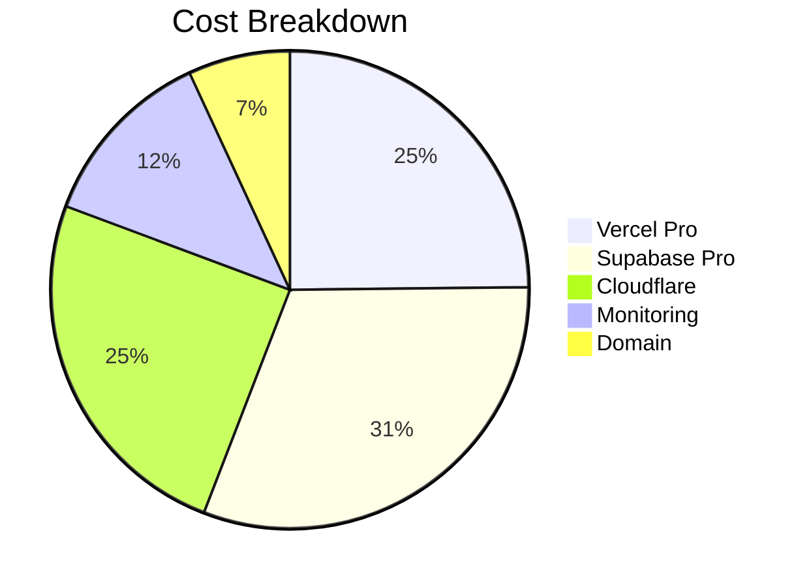

# How to Create Presentation Slides from Markdown

You now have a professional 35-slide presentation ready to present to executives!

**File:** `/Qilly_Executive_Presentation.md`

---

## Quick Start (Recommended Methods)

### ⭐ Method 1: Slidev (Best for Developers)

**Why Slidev:**
- Beautiful, modern slides
- Code syntax highlighting
- Live preview
- Export to PDF/PPTX
- **Free and open source**

#### Installation & Use:

```bash
# Install Slidev globally
npm install -g @slidev/cli

# Create new presentation
slidev Qilly_Executive_Presentation.md

# Opens browser at http://localhost:3030
# Live preview with hot reload!

# Export to PDF
slidev export Qilly_Executive_Presentation.md --format pdf

# Export to PPTX (PowerPoint)
slidev export Qilly_Executive_Presentation.md --format pptx
```

**Customize the theme:**

Create `slidev.config.ts`:
```typescript
import { defineConfig } from '@slidev/cli'

export default defineConfig({
  theme: 'default',
  colorSchema: 'light',
  fonts: {
    sans: 'Inter',
    mono: 'Fira Code'
  },
  highlighter: 'shiki',
  lineNumbers: false,
  drawings: {
    enabled: true
  }
})
```

**Result:** Professional presentation in 5 minutes!

---

### ⭐ Method 2: Marp (Simple & Fast)

**Why Marp:**
- Very simple
- VS Code extension available
- Export to PDF/PPTX/HTML
- Good for corporate presentations

#### Installation:

**VS Code Extension:**
1. Open VS Code
2. Extensions → Search "Marp for VS Code"
3. Install

**Standalone:**
```bash
npm install -g @marp-team/marp-cli
```

#### Convert to Slides:

```bash
# Export to PDF
marp Qilly_Executive_Presentation.md -o Qilly_Presentation.pdf

# Export to PowerPoint
marp Qilly_Executive_Presentation.md -o Qilly_Presentation.pptx

# Export to HTML
marp Qilly_Executive_Presentation.md -o Qilly_Presentation.html
```

**Add Marp metadata** (add to top of file):

```markdown
---
marp: true
theme: default
paginate: true
backgroundColor: #fff
header: 'Qilly Infrastructure Strategy'
footer: 'Confidential - Executive Use Only'
---
```

---

### ⭐ Method 3: reveal.js (Interactive Web Slides)

**Why reveal.js:**
- Beautiful web-based slides
- Keyboard navigation
- Speaker notes
- PDF export
- Mobile-friendly

#### Quick Start:

```bash
# Install reveal-md
npm install -g reveal-md

# Run presentation
reveal-md Qilly_Executive_Presentation.md

# Export to PDF
reveal-md Qilly_Executive_Presentation.md --print Qilly_Presentation.pdf

# Export static HTML
reveal-md Qilly_Executive_Presentation.md --static
```

**Access:** Opens at http://localhost:1948

**Navigation:**
- Arrow keys: Navigate slides
- F: Fullscreen
- S: Speaker view (with notes)
- ESC: Overview mode

---

### Method 4: Google Slides (Manual but Familiar)

**For non-technical executives:**

1. Go to https://slides.google.com
2. Create new presentation
3. Choose template (recommend "Modern Writer")
4. Manually copy content from markdown
5. Format slides
6. Share with team

**Time:** 1-2 hours (manual)

**Pros:** 
- Familiar interface for executives
- Easy collaboration
- Comments and suggestions
- Version history

**Cons:** 
- Manual work
- No automation

---

### Method 5: PowerPoint (Corporate Standard)

#### Option A: Use Marp to Create PPTX

```bash
marp Qilly_Executive_Presentation.md -o Qilly.pptx
```

Then open in PowerPoint and customize.

#### Option B: Pandoc Conversion

```bash
# Install pandoc
brew install pandoc  # Mac
# or download from pandoc.org

# Convert to PowerPoint
pandoc Qilly_Executive_Presentation.md -o Qilly.pptx \
  --reference-doc=template.pptx
```

#### Option C: Manual Creation

1. Open PowerPoint
2. Use corporate template
3. Copy content slide by slide
4. Add charts and images
5. Apply animations

**Time:** 2-3 hours

---

## Comparison: Which Method to Use?

| Method | Quality | Speed | Tech Skill | Best For |
|--------|---------|-------|------------|----------|
| **Slidev** | ⭐⭐⭐⭐⭐ | Fast | Medium | Developers |
| **Marp** | ⭐⭐⭐⭐ | Very Fast | Low | Quick exports |
| **reveal.js** | ⭐⭐⭐⭐⭐ | Fast | Medium | Web presentations |
| **Google Slides** | ⭐⭐⭐ | Slow | None | Teams |
| **PowerPoint** | ⭐⭐⭐⭐ | Slow | Low | Corporate |

---

## Recommended Approach for Your Executive Team

### Step 1: Quick PDF Export (5 minutes)

```bash
# Install Marp CLI
npm install -g @marp-team/marp-cli

# Export to PDF
marp Qilly_Executive_Presentation.md -o Qilly_Presentation.pdf --allow-local-files
```

**Result:** Professional PDF ready to email

### Step 2: Create Interactive Web Version (10 minutes)

```bash
# Install reveal-md
npm install -g reveal-md

# Create static site
reveal-md Qilly_Executive_Presentation.md --static presentation-site

# Upload to Vercel for sharing
cd presentation-site
vercel deploy
```

**Result:** Share link: `https://qilly-presentation.vercel.app`

### Step 3: PowerPoint for Executive Meeting (30 minutes)

```bash
# Export to PPTX
marp Qilly_Executive_Presentation.md -o Qilly.pptx

# Open in PowerPoint
# Customize:
# - Add company logo
# - Apply brand colors
# - Add animations
# - Insert charts/graphs
```

**Result:** Polished PowerPoint for in-person presentation

---

## Enhancing the Presentation

### Add Your Logo

**For Slidev/Marp:**

Add to markdown:
```markdown
---
theme: default
background: /images/background.png
---


# Qilly Infrastructure Strategy
```

### Add Charts

**Use Mermaid (supported in most tools):**

```markdown

```

### Add Speaker Notes

**For reveal.js:**

```markdown
---

## Slide Title

Content here

Note:
These are speaker notes. Press 'S' to see them.
Only you will see these during presentation.
```

---

## Pre-Presentation Checklist

### 1 Day Before:

- [ ] Export to PDF
- [ ] Test all links work
- [ ] Review speaker notes
- [ ] Practice timing (aim for 30-45 mins)
- [ ] Prepare Q&A answers

### Morning of Presentation:

- [ ] Test projector/screen
- [ ] Have PDF backup ready
- [ ] Have printed handouts (executive summary)
- [ ] Prepare demo environment (if showing live system)
- [ ] Charge laptop
- [ ] Bring USB backup

---

## Tips for Effective Delivery

### Pacing

- **Title slide:** 30 seconds
- **Problem/opportunity:** 2-3 minutes per slide
- **Solution details:** 3-5 minutes per slide
- **Financial slides:** 4-5 minutes (expect questions)
- **Q&A:** Reserve 10-15 minutes

**Total:** 30-45 minutes + Q&A

### Key Messages to Emphasize

1. **Problem is clear:** Free tier unstable, need production
2. **Solution is proven:** Vercel + Supabase = industry standard
3. **Cost is justified:** R1,800/month, ROI from 1 bid
4. **Timeline is fast:** 1 week to production
5. **Risk is low:** Easy upgrade path, no vendor lock-in

### Slides to Spend Most Time On

- **Slide 6:** Cost Breakdown (answer budget questions)
- **Slide 10:** ROI Analysis (show value)
- **Slide 24:** Recommendations Summary (decision points)
- **Slide 25:** Financial Summary (final numbers)
- **Slide 29:** Final Recommendation (call to action)

### Slides You Can Skip (if short on time)

- Slide 31-34: Appendices (reference only)
- Slide 14: Multi-environment (technical detail)
- Slide 22: Alternative providers (backup info)

---

## Presentation Formats for Different Audiences

### For C-Suite (15 minutes)

**Use only these slides:**
1. Title (Slide 1)
2. Executive Summary (Slide 2)
3. ROI Analysis (Slide 10)
4. Recommended Solution (Slide 5)
5. Financial Summary (Slide 25)
6. Final Recommendation (Slide 29)
7. Call to Action (Slide 30)

**Focus:** Business value, ROI, decision request

---

### For CFO/Finance (20 minutes)

**Use only these slides:**
1. Title
2. Problem Statement (Slide 3)
3. Cost Breakdown (Slide 6)
4. 4 Options Compared (Slide 7)
5. Phased Rollout (Slide 9)
6. ROI Analysis (Slide 10)
7. Financial Summary (Slide 25)
8. Risk Assessment (Slide 18)
9. Final Recommendation (Slide 29)

**Focus:** Costs, ROI, risks, budget impact

---

### For CTO/Technical (45 minutes)

**Use all slides, emphasize:**
- Slide 5: Architecture details
- Slide 14: Multi-environment setup
- Slide 15: Automated deployments
- Slide 16: Database health management
- Slide 22: Alternative providers
- Appendix A: Technical architecture

**Focus:** Technical feasibility, reliability, scalability

---

### For Department of Human Settlements (30 minutes)

**Use these slides:**
1. Title
2. Executive Summary
3. The Opportunity (Slide 4)
4. Recommended Solution (Slide 5)
5. POPIA Compliance (Slide 12)
6. Security Features (Slide 13)
7. Competitive Advantage (Slide 20)
8. Success Metrics (Slide 19)
9. Final Recommendation (Slide 29)

**Focus:** Compliance, security, reliability, value to government

---

## After the Presentation

### Follow-Up Materials

**Email within 24 hours:**

```
Subject: Qilly Infrastructure Decision - Supporting Documents

Dear [Executive Team],

Thank you for your time in today's presentation. As discussed, 
please find attached:

1. Qilly_Presentation.pdf (35 slides)
2. Qilly_Hosting_Architecture_Report.pdf (26-page detailed analysis)
3. QUICK_REFERENCE.pdf (4-page summary)
4. Cost_Comparison_Spreadsheet.xlsx

Key Decisions Requested:
• Budget approval: R1,800/month
• Timeline commitment: 1 week implementation
• Authority to proceed with Vercel + Supabase Pro

Next Steps:
• Decision by [Date]
• Implementation starts [Date]
• Production deployment [Date]
• DoHS demo [Date]

Please let me know if you need any clarification.

Best regards,
[Your Name]
```

### Questions Log

Keep track of questions asked during presentation:

| Question | Asked By | Answer | Follow-up Needed |
|----------|----------|--------|------------------|
| Can we start cheaper? | CFO | Yes, R910/mo option | Send breakdown |
| SA data residency? | Legal | Not required now | POPIA review |
| Support availability? | CTO | 24/7 vendor + internal | Document SLAs |

---

## Export Commands Cheat Sheet

```bash
# Slidev
slidev export Qilly_Executive_Presentation.md --format pdf
slidev export Qilly_Executive_Presentation.md --format pptx

# Marp
marp Qilly_Executive_Presentation.md -o Qilly.pdf
marp Qilly_Executive_Presentation.md -o Qilly.pptx

# reveal.js
reveal-md Qilly_Executive_Presentation.md --print Qilly.pdf
reveal-md Qilly_Executive_Presentation.md --static

# Pandoc
pandoc Qilly_Executive_Presentation.md -o Qilly.pptx
pandoc Qilly_Executive_Presentation.md -o Qilly.pdf
```

---

## Troubleshooting

### Issue: Images not showing

**Solution:**
```bash
# Use absolute paths


# Or allow local files
marp --allow-local-files Qilly_Executive_Presentation.md
```

### Issue: Tables not rendering

**Solution:** Make sure tables have proper markdown syntax:

```markdown
| Column 1 | Column 2 |
|----------|----------|
| Data 1   | Data 2   |
```

### Issue: Code blocks not highlighted

**Solution:** Specify language:

```markdown
```typescript
const example = "code";
```
```

---

## Final Recommendations

**For Your Executive Presentation:**

1. **Use Marp** to export to PDF (5 minutes)
2. **Email PDF** to executives before meeting (give 24 hours to review)
3. **Use PowerPoint** during actual presentation (import from Marp PPTX)
4. **Have PDF backup** on laptop and USB drive
5. **Print executive summary** (1-page) as handout

**Time Investment:**
- PDF export: 5 minutes
- PowerPoint customization: 30 minutes
- Practice run: 30 minutes
- **Total:** 65 minutes

**You're ready to present!** 🚀

---

**Files Created:**

✅ `/Qilly_Executive_Presentation.md` (35 slides)  
✅ This export guide  
✅ All technical documentation

**Next Step:** Run this command to create your PDF:

```bash
npm install -g @marp-team/marp-cli
marp Qilly_Executive_Presentation.md -o Qilly_Presentation.pdf
```

Good luck with your presentation! 🎯
